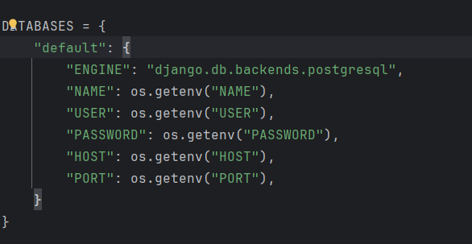
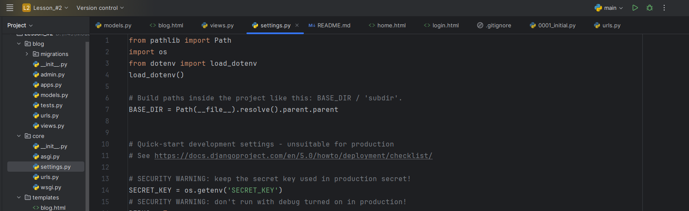
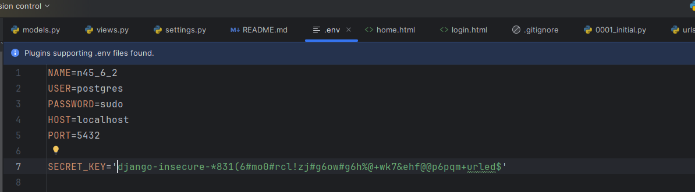
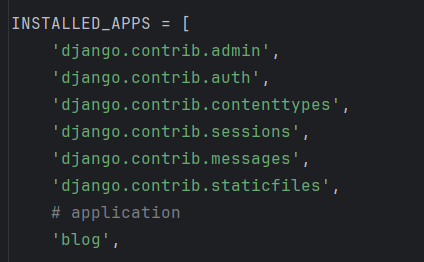
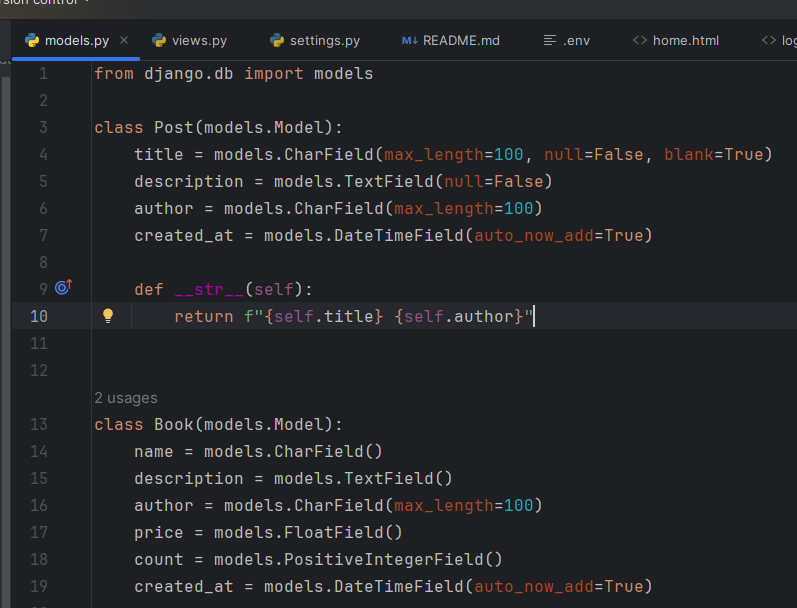

# 1. Creating virtualenv
```shell
python3 -m venv venv
```
# 2. Activate Virtualenv
- Windows
```shell
.\venv\Scripts\activate
```

- MacOs or Linux
```shell
source venv/bin/activate
```

# 3. Starting new project created
```shell
django-admin startproject project_name .
```

# 4. Creating new application
```shell
python3 manage.py startapp app_name
```

# 5. Setup setting.py module
- # Database

- # Secret Key

# .env


# 6. Creating urls.py in app
# 7. Connection application


# 8. Creating models in models.py


